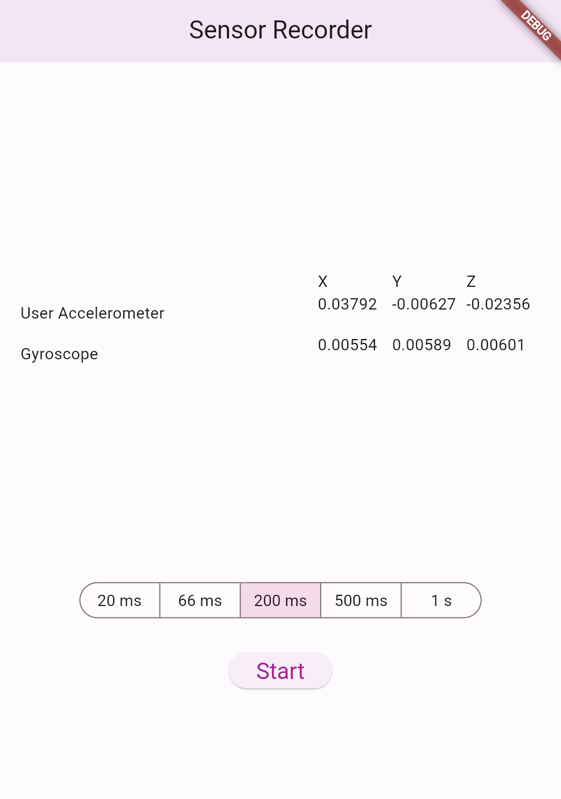

# iPhone Sensor Recorder

iOS app using Swift, Objective-C, and Flutter to record iPhone gyroscope and accelerometer data. 

Created using the Flutter starter app template on Visual Studio Code and editing main.dart:

1. Go to View > Command Palette.... (You can also press Ctrl / Cmd + Shift + P)

2. Type flutter.

3. Select the Flutter: New Project.

4. Press Enter.

5. Select Application.

6. Press Enter.

7. Select a Project location.

8. Enter your desired Project name.

9. Replace main.dart
